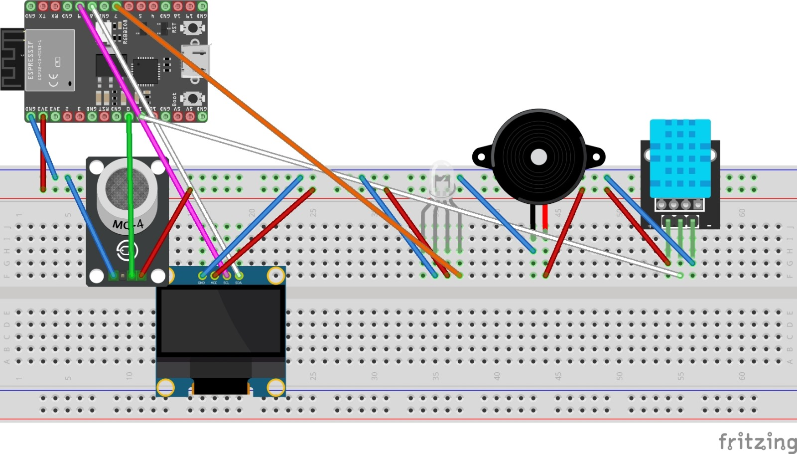
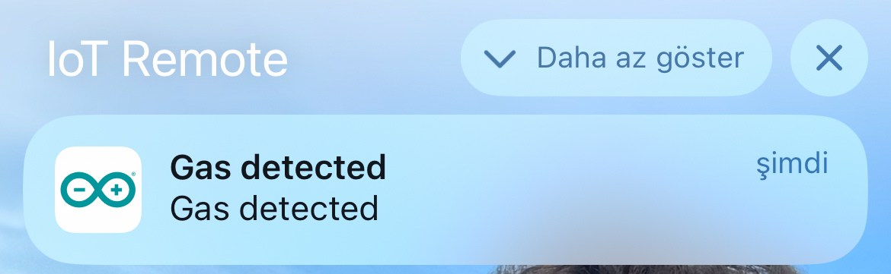
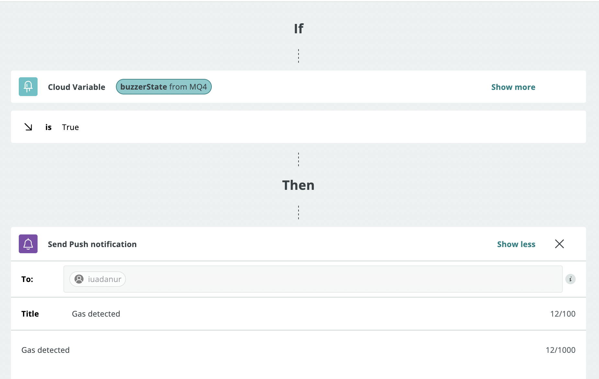
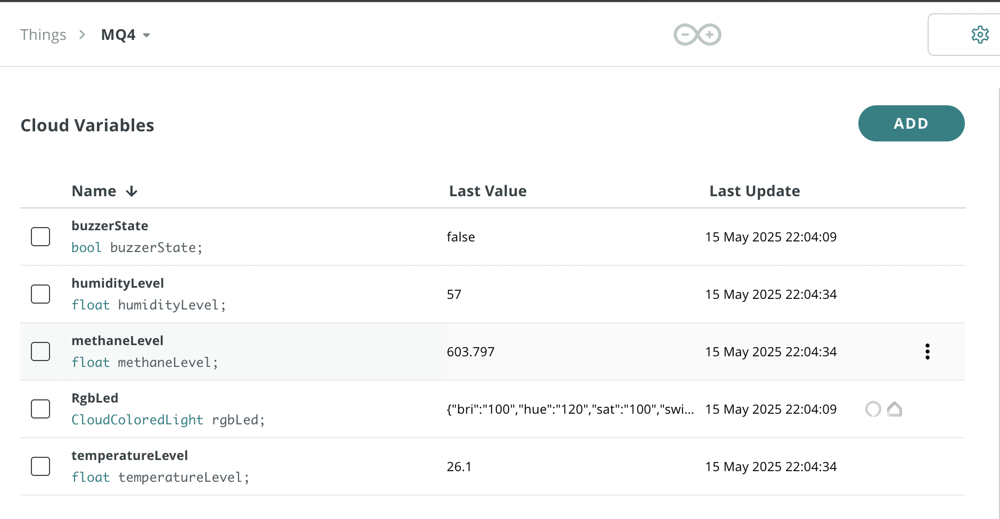
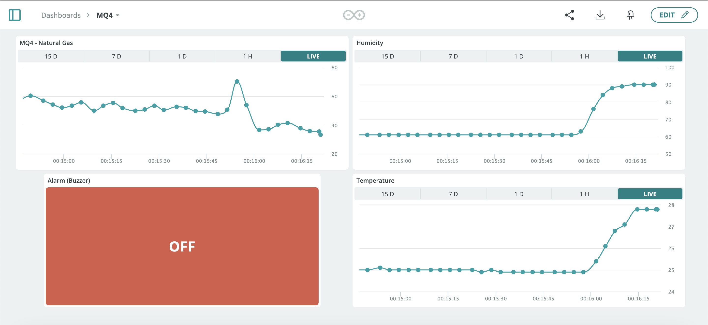
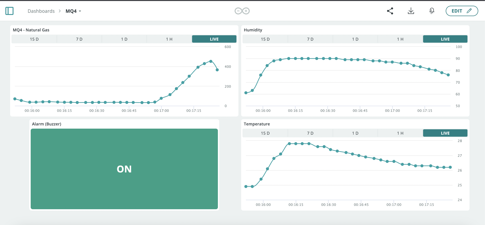

# IoT-Based Natural Gas Leak Detection System Using ESP32

This project implements a smart natural gas (methane) leak detection and alert system using the **ESP32** development board. The system monitors gas levels and environmental conditions, triggers alerts when danger is detected, and sends real-time data to the cloud.

## 📌 Project Overview

Gas leaks can be life-threatening if not detected early. Manual detection methods are often unreliable and delayed. This IoT-based solution aims to:

- Automatically detect gas leaks
- Provide sound and visual alerts
- Display data on a local OLED screen
- Send real-time sensor data to the Arduino IoT Cloud for remote monitoring

## 🛠️ Hardware Components

- **ESP32 DevKit v1** (microcontroller)
- **MQ4 Gas Sensor** (for methane detection)
- **DHT11 Sensor** (temperature and humidity)
- **RGB LED** (visual alerts)
- **Buzzer** (sound alerts)
- **OLED Display** (SH1106, for local output)

## 🌐 Communication & Cloud

- **Wi-Fi** connectivity
- **MQTT Protocol** for data transmission
- **Arduino IoT Cloud** for online data visualization and alert management

## ⚙️ System Functionality

- Gas level is constantly monitored using the MQ4 sensor
- If gas concentration exceeds a defined threshold:
  - RGB LED turns **red**
  - Buzzer is activated
- If below threshold:
  - RGB LED stays **green**
  - Buzzer remains off
- OLED screen shows:
  - Gas level
  - Temperature
  - Humidity
- All data is also pushed to the Arduino IoT Cloud dashboard

## 🔒 Security Features

- Wi-Fi network authentication
- Arduino IoT Cloud user account authentication

## 📊 Results

- Gas detection and alert system performs reliably
- Real-time data is visualized on both local and cloud interfaces
- Environmental data (temperature & humidity) enhances monitoring context

## 📷 Project Photos

.Circuit Setup

.Arduino Serial Monitor Outputs
image::images/Ekran Resmi 2025-05-16 00.14.07.png[width=600]

.Push Notification

.Arduino IoT Trigger Settings

.Arduino IoT Variables

.Dashboard When Gas Not Detected

.Dashboard When Gas Detected

## 🚀 Future Work

- Add battery power for portable operation
- Enclose the device for safety and mobility
- Explore integration with smart home systems (e.g., Alexa, Google Home)

## 📚 Libraries Used

- `ArduinoIoTCloud`
- `MQUnifiedsensor`
- `DHT`
- `Adafruit_GFX`
- `Adafruit_SH110X`

> Developed as a term project for CSE328 - Internet of Things, Akdeniz University, Computer Engineering Department.
